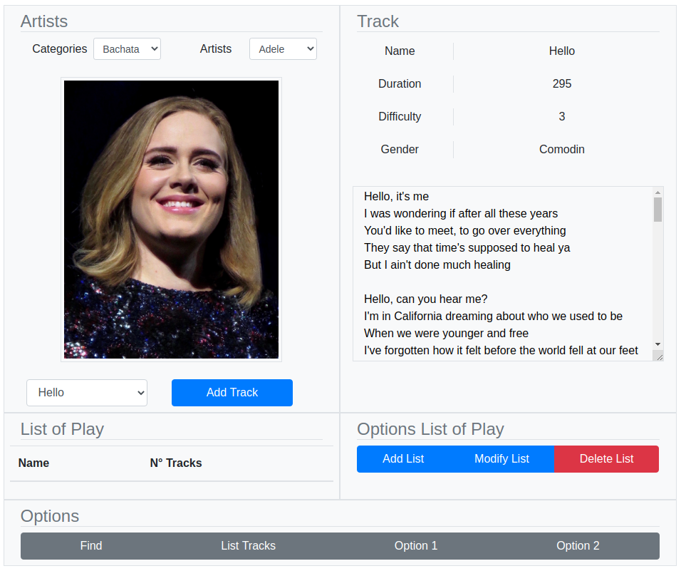

# Enunciado

We want to develop an application to manage the songs of a karaoke. The application has 4
musical categories (Rock, Pop, Latin Fusion and Electro) and 9 artists belonging to one of the
different categories. Additionally, the application must allow the management of playlists, where
each list can have songs from different artists.

An artist can refer to a band or a solo artist.

Every artist is known:

- The name. There cannot be two artists with the same name.
- An image of the artist.
- The list of his songs, there cannot be two songs with the same name.

For each song, you have the following information:

- Name.
- Duration in seconds.
- Difficulty: value between 1 and 10 indicating the difficulty to interpret the song, where 1 is the difficulty
the lowest and 10 the highest.
- Lyrics to the song.
- File with the track of the song in mp3 format.

For each playlist you have:

- Name. There can't be two playlists with the same name.
- Number of songs.
- The list of your songs, where you can't add the same song twice and must have
minus one song.

The application is required to allow:

1. Show the information of an artist.
2. Add a song to a karaoke artist.
3. Show the information of a song.
4. Play a song.
5. Pause the playback of a song.
6. Stop playing a song.
7. Search for the easiest song.
8. Search for the hardest song.
9. Search for the longest song.
10. Search for the shortest song.
11. Search for the artist with the most songs.
12. Show all songs in a category.
13. View the list of all existing playlists in the karaoke.
14. Create a playlist.
15. Delete a playlist.
16. Add a song to a playlist.
17. Delete a song from a playlist.

 
Traslate with help Deepl

# Interfaz

    

This project was bootstrapped with [Create React App](https://github.com/facebook/create-react-app).

## Available Scripts

In the project directory, you can run:

### `npm start`

Runs the app in the development mode. 
Open [http://localhost:3000](http://localhost:3000) to view it in the browser.

The page will reload if you make edits. 
You will also see any lint errors in the console.
